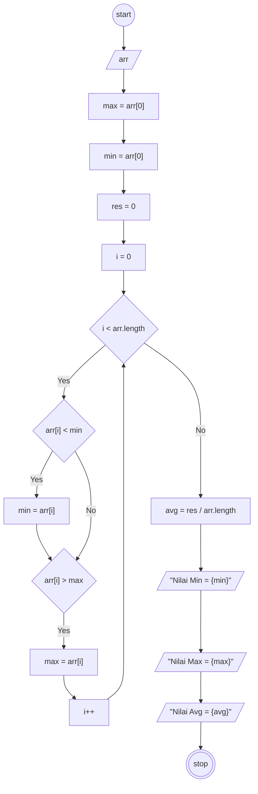

# Flowchart

## Program untuk mendapatkan Max, Min dan Average

Algoritma ini dirancang untuk membuat proses mendapatkan nilai Max, Min, dan Average dari sebuah array

```mermaid

flowchart TD

start@{shape: circle, label: "start"}
inp@{shape: lean-r, label: "arr"}
max@{shape: rect, label: "max = arr[0]"}
min@{shape: rect, label: "min = arr[0]"}
res@{shape: rect, label: "res = 0"}
avg@{shape: rect, label: "avg = res / arr.length"}
init@{shape: rect, label: "i = 0"}
ctr@{shape: rect, label: "i++"}
con@{shape: diam, label: "i < arr.length"}
conMin@{shape: diam, label: "arr[i] < min"}
assignMin@{shape: rect, label: "min = arr[i]"}
conMax@{shape: diam, label: "arr[i] > max"}
assignMax@{shape: rect, label: "max = arr[i]"}
outputMin@{shape: lean-r, label: '"Nilai Min = {min}"'}
outputMax@{shape: lean-r, label: '"Nilai Max = {max}"'}
outputAvg@{shape: lean-r, label: '"Nilai Avg = {avg}"'}
fin@{shape: double-circle, label: "stop"}

start-->inp-->max-->min-->res-->init-->con
con-- No --->avg-->outputMin-->outputMax-->outputAvg-->fin
con-- Yes -->conMin-- Yes -->assignMin-->conMax
conMin-- No -->conMax-- Yes -->assignMax-->ctr-->con

```